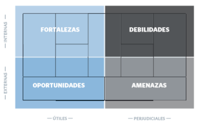

# Generación de modelos de negocio

 \[\[_TOC_\]\]

## Lienzo

* [video](https://vimeo.com/78350794)
* The canvas 



* La mitad izquierda corresponde a la Eficiencia/Logica
* La mitad derecha corresponde al Valor/Emociones

### Segmento de mercado

Una empresa atiende a uno o varios segmento de mercado.

* Mercado de masas
* Nicho de mercado. \(Mercado especifico\)
* Mercado segmentado. \(Sobre un mismo mismo valor ofrecido a varia escala. B2B/B2C para el mismo producto por ejemplo\)
* Mercado diversificado. \(Amazon vende libros y ofrece cloud\)
* Plataforma o mercado multilateral. \(Interdependencia entre mercados segmentados. Anunciantes/clientes\)

### Propuesta de Valor

Su objetivo es solucionar los problemas de los clientes y satisfacer sus necesidades mediante propuestas de valor.

* Novedad
* Mejora del rendimiento
* Personalización
* "El trabajo bien hecho"
* Diseño
* Marca/estatus
* Precio
* Reducción de costes
* Reducción de riesgos
* Accesibilidad
* Comodidad/utilidad

### Canales

Las propuestas de valor llegan a los clientes a través de canales de comunicación, distribución y venta.

#### Tipos de canal

* Equipo comercial \[Propio, Directo\]
* Venta en internet \[Propio, Directo\]
* Tienda propia \[Propio, Indirecto\]
* Tienda de socios \[Socio, Indirecto\]
* Mayorista \[Socio, Indirecto\]

#### Fases de canal

1. Información. ¿Como damos a conocer los productos y servicios de nuestra empresa?
2. Evaluación. ¿Como ayudamos a los clientes a evaluar nuestra propuesta de valor?
3. Compra. ¿Como pueden comprar los clientes nuestros productos y servicios?
4. Entrega. ¿Como entregamos a los clientes nuestra propuesta de valor?
5. Pos venta. ¿Que servicio de atención pos venta ofrecemos? 

### Relaciones con clientes

Se establecen y mantienen de forma independiente en los diferentes segmentos de mercado.

* Asistencia personal
* Asistencia personal exclusiva
* Autoservicio
* Servicios automáticos
* Comunidades
* Creación colectiva

### Fuentes de ingresos

Las fuentes de ingresos se generan cuando los clientes adquieren las propuestas de valor ofrecidas.

* Venta de activos
* Cuota por uso
* Cuota de suscripción 
* Prestramo/alquiler/leasing
* Concesión de licencias

#### Mecanismos de fijación de precios

| fijo | Dinámico |
| :--- | :--- |
| Basado en variables estáticas | Cambian en función del mercado |
| Lista de precios fija | Negociación |
| Según características del producto | Gestión de la rentabilidad |
| Según segmente de mercado | Mercado en tiempo real |
| Según volumen | Subasta |

### Recursos clave

Son los activos necesarios para ofrecer y proporcionar los elementos antes descritos mediante una serie de actividades claves.

* Físicos
* Intelectuales
* Humanos
* Económicos

### Actividades claves

* Producción 
* Resolución de problemas
* Plataforma/red

### Asociaciones clave

Algunas actividades se externalizan y determinados recursos se adquieren fuera de la empresa.

* Optimizan y economía de escala
* Reducción de riesgos e incertidumbre
* Compra de determinados recursos y actividades

### Estructura de costes

Los diferentes elementos del modelo de negocio conforman la estructura de coste. **Segun coste**. El objetivo de los modelos de negocio basados en los costes es recortar gastos **Segun valor**. Centrados en la exclusividad de su valor. Lujo, premium, etc...

#### Caracteristicas de las estructuras de coste

* Costes fijos
* Costes variables
* Economías de Escala.
* Economías de campo. Aplicación de un mismo costa a varios campos de la actividad.

### ejemplo: Apple ipod

## Patrones

### Desagregación de modelos de negocio

| **Contexto \(antes\)** | **Reto** | **Solución \(después\)** | **Fundamento** | **Ejemplo** |
| :--- | :--- | :--- | :--- | :--- |
| Un modelo integrado combina la gestión de infraestructuras, la innovación de productos y las relaciones con los clientes bajo un mismo techo. | Los costes son muy elevados. Se mezclan varias culturas empresariales opuestas en una sola entidad, los cual tiene como resultado renuncias no deseadas. | La empresa se divide en tres modelos independientes, aunque complementarios, que se ocupan de 1. Gestión de infraestructuras, 2. Innovación de producto, 3. Relaciones con clientes. | La mejora de las herramientas de gestión y TI permiten separar y coordinar modelos de negocio diferentes con un coste inferior, eliminando así las renuncias no deseadas. | Banca privada, Empresas de telecomunicaciones. |

### La larga cola

| **Contexto \(antes\)** | **Reto** | **Solución \(después\)** | **Fundamento** | **Ejemplo** |
| :--- | :--- | :--- | :--- | :--- |
| La propuesta de valor se dirige únicamente a los clientes mas rentables. | La creación de propuestas de valor para segmentos de mercado poco rentables resulta demasiado cara. | La nueva propuesta de valor, o la propuesta adicional, se dirige a un amplio abanico de nichos de mercado que antes eran poco rentables y que, en conjunto, son rentables. | La mejora de la gestión de operaciones y TI permite ofrecer propuestas de valor personalizadas a una extensa cartera de clientes nuevos con un coste bajo. | Sector editorial \(Lulu.com\), LEGO. |

### Plataforma multilateral

| **Contexto \(antes\)** | **Reto** | **Solución \(después\)** | **Fundamento** | **Ejemplo** |
| :--- | :--- | :--- | :--- | :--- |
| Una propuesta de valor para cada segmento de mercado. | La empresa no capta clientes nuevos potenciales que estén interesados en unirse a la cartera de clientes actuales de la empresa \(por ejemplo, desarrolladores de videojuegos que quieren llegar a los usuarios de las consolas. | Se añade una propuesta  de valor que da acceso al segmento de mercado de una empresa \(por ejemplo, un fabricante de videoconsolas que proporciona a los desarrolladores de software acceso a sus usuarios. | Un intermediario que explota una plataforma en dos o mas segmentos de mercado añade fuentes de ingresos al modelo inicial. | Google, Consolas de videojuegos de Nintendo, Sony, Microsoft, Apple |

### GRATIS como modelo de negocio

| **Contexto \(antes\)** | **Reto** | **Solución \(después\)** | **Fundamento** | **Ejemplo** |
| :--- | :--- | :--- | :--- | :--- |
| Solo se ofrece una propuesta de valor de coste y valor elevados a los clientes que pagan jpor el servicio o producto. | El elevado precio disuade a los clientes | Se ofrecen varias propuestas de valor a diferentes segmentos de mercado con fuentes de ingresos diferentes, una de las cuales es gratuita \(o muy barata\) | Los segmentos de mercado que disfrutan de la propuesta gratuita están subvencionados por los clientes que pagan, que quieren atraer al mayor numero posible de usuarios. | Publicidad y periódicos, Metro \(revista\), Flickr, Código abierto, Red Hat, Skype, Gillette |

### Modelos de negocio abiertos

| **Contexto \(antes\)** | **Reto** | **Solución \(después\)** | **Fundamento** | **Ejemplo** |
| :--- | :--- | :--- | :--- | :--- |
| Los recursos de I+D y las actividades clave se concentran en la empresa: las ideas solo se conciben internamente, los resultados solo se explotan internamente. | El proceso de I+D es caro y/o la productividad no es la adecuada. | Se recurre a socios externos para aprovechar los recursos y las actividades de I+D. Los recursos internos de I+D se convierten en propuesta de valor y se ofrecen a los segmentos de mercado que estén interesados. | Las adquisición de I+D a fuentes externas puede ser mas económica y reducir el plazo de comercialización. Las innovaciones desaprovechadas pueden generar ingresos si se venden fuera de la empresa. | Procter & Gamble, GlaxoSmithKline, InnoCentive |

## Diseño

Se trata se las técnicas de generación, mejora y presentación de modelos de negocio.

### Técnica 1 - Aportaciones de cliente

El Mapa de Empatía

### Técnica 2 - Ideación

#### Epicentro de la innovación en modelos de negocio

| Recursos | Propuesta de Valor | Clientes | Finanzas | Varios Epicentros |
| :--- | :--- | :--- | :--- | :--- |
|  |  |  |  |  |
| Las innovaciones basadas en recursos nacen de las infraestructuras propias de las empresas y de las asociaciones con otras empresas o personas. El objetivo principal es la ampliación del modelo de negocio. | Este tipo de epicentro cambia por completo la propuesta de valor, generando nuevos productos o servicios, lo que conlleva a realizar cambios estructurales en el resto de bloques. | En este caso, la innovación está basada en necesidades nuevas de clientes, búsqueda de una mayor comodidad, o desarrollo de nuevos usuarios para un producto o servicio. | Nacen de idear nuevas fuentes de ingresos, obtener nuevos mecanismos de fijación de precios, reducir estructuras de costos o cualquier idea nueva que pretenda modificar los cuadros inferiores del Business Model Canvas. | Y por último, en este caso, la innovación no viene de un epicentro concreto, si no que su origen está en varios puntos diferentes del lienzo de modelo de negocio. |
| un bar que aprovecha su infraestructura para realizar exposiciones de pintura en sus paredes. El bar dispone de todo lo necesario para ello, y puede ampliar su negocio, genera una nueva propuesta de valor, llega los clientes de una manera diferente, atrae más clientes y por tanto genera más ingresos, dando otra utilidad a las paredes vacías de su local. Su modelo de negocio se ha modificado, gracias a un nuevo enfoque de uso de su infraestructura. | la peluquería canina a domicilio. La nueva propuesta de valor es realizar a domicilio, un servicio que antes solo se hacía en tiendas especializadas, ofreciendo mayor comodidad y una propuesta de valor diferente. Este cambio repercute en el resto de bloques del modelo de negocio, generando nuevas infraestructuras \(furgoneta\), nuevas fuentes de ingresos y costes y nuevos clientes. | En el caso de las cámaras de fotos digitales, lo que se ofrece es una manera más cómoda y sencillas de realizar fotografías, e incluso la posibilidad de revelarlas uno mismo. Esto con la fotografía analógica, no estaba al alcance de cualquier persona, por ello, una modificación en esta parte del canvas afectará al resto de estructuras; costes, propuesta de valor, canales…. | Un ejemplo bastante claro al respecto de este epicentro de innovación es el modelo de negocio de los fabricantes de impresoras, donde ya no es el modelo de negocio tradicional de venta de impresoras, si no que ha pasado a ser el de venta de consumibles. Los principales beneficios se generan en la venta de cartuchos de tinta, dejando el precio final de las  impresoras sin apenas margen, pero accesible al gran público. | Para este tipo de epicentro de innovación tenemos el ejemplo de la consola Wii de Nintendo, donde se produjo un cambio radical en el tipo de cliente, la propuesta de valor y en la estructura de costes, pasando a tener una consola para jugadores ocasionales, a un menor precio que la competencia y con posibilidades de juego apta para todo el mundo. La revolución fue espectacular y fue líder de ventas. |

#### ¿Y Si?

A menudo tenemos dificultades para concebir modelos de negocio innovadores porque nuestro pensamiento se ve reprimido por el statu quo. El Statu Quo nubla la imaginación. Las preguntas del tipo "y si..." que desafían las premisas convencionales, son uno de los métodos disponibles para solucionar este problema.

#### Proceso de Ideación

1. Formación del equipo
2. Inmersión \(investigación, estudios de clientes, escrutinio de nuevas tecnologías ...\)
3. Expansión \(generar tantas ideas como sea posible\)
4. Selección de Criterios \(reducción de los modelos\)
5. Creación de prototipos

### Técnica 3 - Pensamiento Visual

* Notas auto-adhesivas
* Visualización con dibujos

|  |  |
| :--- | :--- |

### Técnica 4 - Creación de prototipos

| escala | descripcion |
| :--- | :--- |
| dibujo en una servilleta | esboza y da forma a una idea indefinida |
| lienzo elaborado | investiga qué hace falta para que la idea funcione |
| plan de negocio | estudia la viabilidad de la idea |
| prueba de campo | investiga la aceptación de los clientes y la factibilidad |

### Técnica 5 - Narración de historias

¿Por qué contar una historia?

* Presentación de lo nuevo 
* Venta a los inversores
* Implicación de los empleados
* Convertir un modelo en tangible

El objetivo de contar una historia es presentar un modelo de negocio nuevo de forma tangible y atractiva. La historia debe ser sencilla y tener un único protagonista. Puedes cambiar de protagonista y perspectiva en función del público. A continuación se indican dos puntos de partida posibles

### Técnica 6 - Escenarios

* Escenarios para diferente segmentos o punto de vista \(empleado, cliente, dirección\)
* Escenarios futuros 

## Estrategia

### Entorno del modelo de negocio

 Ver libro para mas detalle

### Evaluación de modelos de negocio

* ejemplo:

* DAFO

* Aplicar el dafo a cada uno de los elementos del Modelos de negocio.
* En el libro encontramos una lista exhaustiva de preguntas para cada componente del modelo. \(Muy interesante\) 

### Perspectiva de los modelos de negocio sobre la estrategia océano azul

### Gestión de varios modelos de negocio

* Fuera de mi alcance por el momento. \(ver libro\) 

## Proceso

