# Análisis Técnico de los Mercados Financieros

 

[amazon](https://www.amazon.es/An%C3%A1lisis-t%C3%A9cnico-mercados-financieros-colecci%C3%B3n/dp/8498754283)

## Capitulo 1 - Filosofía del análisis técnico

### Fundamentos

1. Los movimientos del mercado lo descuentan todo.
2. Los precios se mueven por tendencias.
3. La Historia se repite.º

   **Breve comparación del análisis técnico de valores y futuros.**

4. Estructura de precio
5. Duración limitada - fecha de caducidad.
6. Requisitos de menor margen
7. El margen de tiempo es mucho mas corto
8. Mayor dependencia del tiempo
9. Menor confianza en promedios e indicadores del mercado

   **Criticas al enfoque técnico**

10. Profecía del auto cumplimiento
11. Los patrones gráficos son subjetivos. 

    **Se puede usa el pasado para predecir el futuro?**

12. Estadística descriptiva. generación de gráficos
13. Estadística inductiva. creación de Predicciones

    **La teoría del Random Walk \(Paseo Aleatorio\)**

14. Los cambios en los precios son serialmente independientes.
15. Basado en la teoría de los mercados eficientes.
16. La mejor estrategia  es comprar y retener en contra de "vencer al mercado".

## Capitulo 2 - Teoría del Dow

### Principios básicos

1. Las medias lo descuentan todo
2. El mercado tiene 3 tendencias
   1. Primaria o principales. x &gt; 1 años
   2. secundaria o intermedia. 3 semanas &lt; x &lt; 3 meses.
   3. menor. x  &lt; 3 semanas.
3. Las tendencias principales tienen tres fases.
   1. Acumulación. Astutos inversores reconocen que el mercado ha asimilado todas las llamadas "malas noticias"
   2. Participación. Donde se empieza a seguir la tendencia.
   3. Distribución. Todos participan y aumenta el volumen especulativo.
4. Las medias deben confirmarse entre ellas.
5. El volumen debe confirmar la tendencia
6. Se presume que una tendencia esta en vigor hasta que da señales definitivas de que ha retrocedido
   * El retroceso: mala y buena oscilación.

     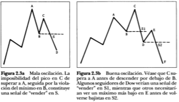

     **Criticas**

     La teoría de Dow no se hice para predecir sino para describir.

     Para una escara de tiempo larga. No sirve en el intradia y futuros.

## Capitulo 3 - Construcción de gráficos

### Tipos

* Gráfico de barras
* Gráfico de lineas
* Gráfico de puntos y figuras
* Gráfico de Velas

  **Escalas**

* Escala aritmética
* Escala logarítmica

  **Volumen**

  Es la cantidad total de contratos de un mercado en un determinado rango temporal o el número de acciones comunes que cambian de mano en un día concreto en el mercado de valores.

### Interés abierto de los futuros

Cantidad de contratos en circulación al final de un periodo, pero de una sola posición \(o larga o corta\)

### Volumen e interés abierto informados un día después en los futuros

Estos datos se informan con un día de retraso.

## Capitulo 4 - Conceptos básicos de tendencia

### La tendencia tiene tres direcciones

al alza - picos y valles ascendentes. \(comprar\) a las baja - picos y valles descendentes. \(vender\) lateral - picos y valles horizontales. \(mantenerse fuera del mercado\)

### La tendencias tiene tres calificaciones

Idea fractal de la tendencia. En la teoría de Dow ver las 3 tendencias.

### Apoyo y resistencia.

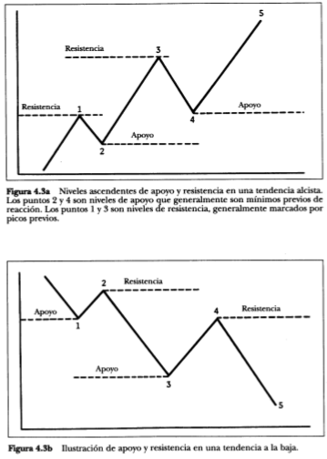

 Intercambio de papeles de los niveles de apoyo y resistencia. 

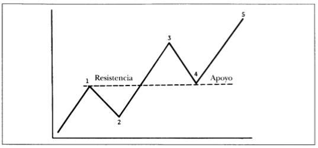

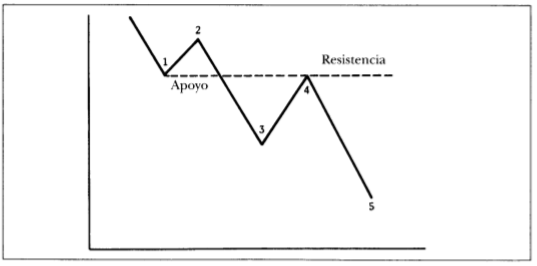

**Importancia de los números redondos como apoyo y resistencia. Niveles psicológicos \(10, 20 , 25 , 50, 75, 100, 1000 ...\).**

### Lineas de tendencia

* Linea de tendencia al alza: se necesitan 2 mínimos.
* Linea de tendencia a la baja: se necesitan 2 máximos.
* se necesitan 2 puntos para trazar una linea de tendencia \(entre el punto 3 y 4 ya se puede dibujar\)
* se necesitan 3 puntos para trazar un tendencia linea de tendencia valida \(en el punto 5\)

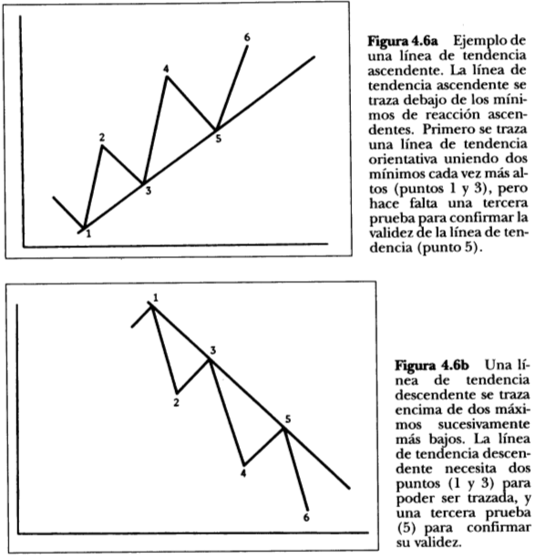

### Como usa la linea de tendencia

* Una tendencia en movimiento tiende a mantenerse en movimiento. 
* Tendencia a mantener la inclinación.
* Puede ser un indicador de un cambio de tendencia.
* Mas a prueba se ha puesto una  linea de tendencia mas importancia tiene.

  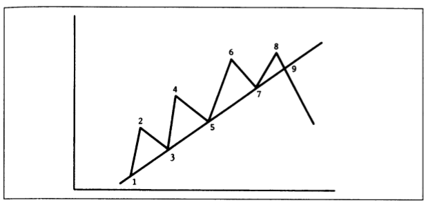

  **Las lineas de tendencia deberían incluir todos los precios.**

* No cruzar la barras o velas

  **Como tratar las pequeñas penetraciones de la linea de tendencia.**

* No hay regla única a seguir.
* Trazar la nueva linea y a medida que avanza el precio ver si se confirma o era únicamente una pequeña penetración,

  **¿Que constituye un ruptura válida de una línea de tendencia?**

  Como filtras señales malas o "whipsaws"?. Cada un aplica sus filtros.

  Ejemplo: el filtro del 3%. Rotura de la tendencia en un mínimo del 3% al final del día.

  Ejemplo: El tiempo. Un ruptura se confirma si durante 2 días seguidos se mantiene la ruptura.

  **Las lineas de tendencia dan la vuelta a sus papeles**

  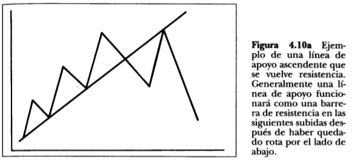

  **El principio de abanico**

  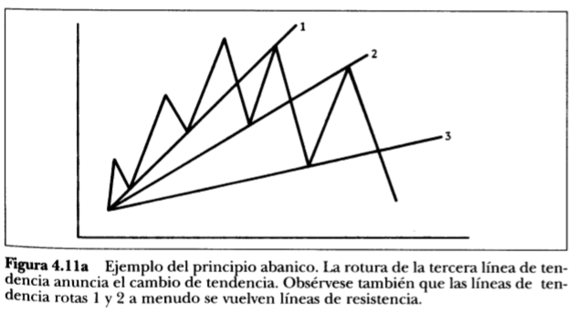

  **La importancia del numero tres**

* el principio de abanico
* La teoría de Dow: el mercado tiene 3 tendencias
* La teoría de Dow; las tendencias tienen 3 fases
* Modelos de cambio: el triple techo y el cabeza hombro
* 3 fuentes principales de información: precio volumen e interés abierto.
* ...

  **La relativa inclinación de la linea de tendencia**

* Suele ser de 45º
* Si es muy inclinada, generalmente los precios avanzan demasiado rápido y no se sostendrá.
* Si es demasiado aplanada, puede indicar que es demasiado débil y no genera confianza.

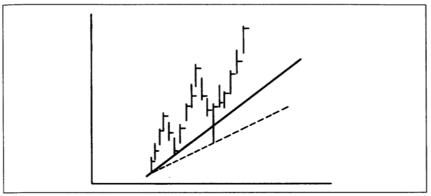

### Cómo ajustar lineas de tendencia

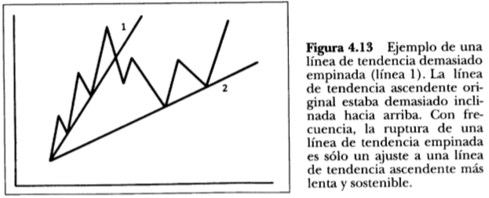

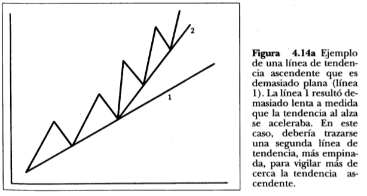

### Linea de canal

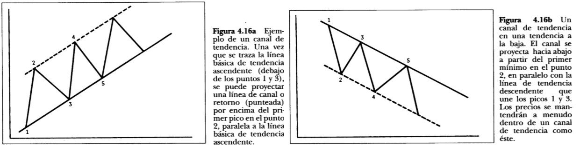

### Cambios en el canal

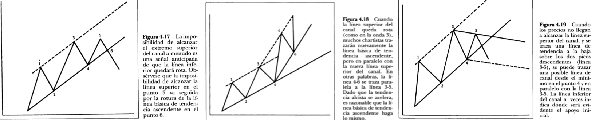

### Retroceso porcentual

entre el 33% y el 66 % y de media el 50%

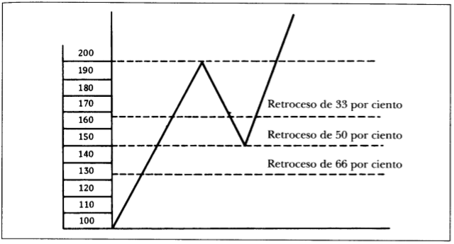

### Otras lineas de tendencias

* Lineas de resistencia a la velocidad, de Edson Gould. \(sin interés de momento\)
* Lineas de abanico de Gann y Fibonacci. \(sin interés de momento\)
* Lineas internas de tendencia. Se dibujan entre maximos y mínimos dentro de una tendencia. Muy subjetivas.

### Días de cambio

* Nuevo máximo durante el día \(al alza\).
* Cierre mas bajo que el cierre del día anterior \(al alza\). cambios semanales y mensuales. Son importantes como indicadores!

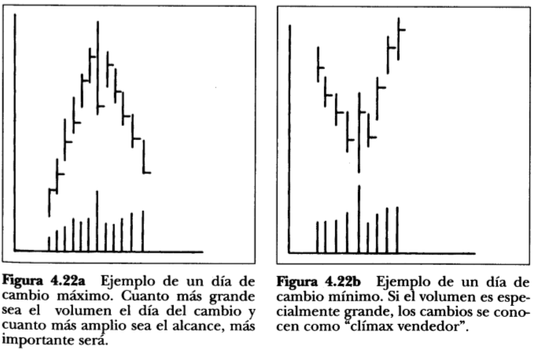

### Huecos de precio

1. Huecos de separación \(breakaway\). seguido de un retrocezo
2. Hueco de escape o medida \(runaway\). mantiene la tendencia
3. Hueco de agotamiento \(exhaustion\). cambio de tendencia.

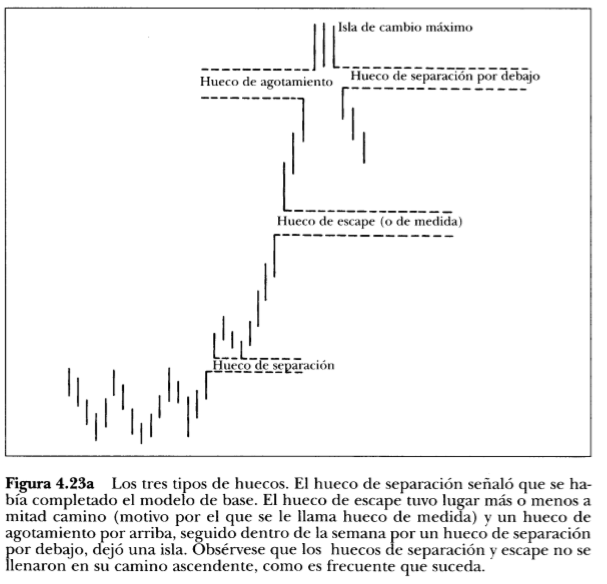

## Capitulo 5 - Los modelos de cambio más importantes

### Modelos de precios

patrones gráficos recurrentes \(predictibles\) **Modelos de cambio** 1. cabeza y hombro 1. topes superiores e inferiores triples 1. topes superiores e inferiores dobles 1. topes superiores e inferiores en púa 1. patrón redondo

**Modelos de continuidad** 1. triángulos 1. banderas 1. banderines 1. cuñas 1. rectángulos

### Aspectos preliminares a todos los modelos de cambio

1. Existencia de una tendencia anterior
2. la primera señal es a menudo la ruptura de una importante linea de tendencia.
3. Cuando mas grande sea el patrón, mayor será el movimiento subsiguiente.
4. Los superior generalmente tienen una duración mas corta y son mas volátiles que los inferiores
5. Los inferiores generalmente tienen bandas de precio más pequeñas y lleva más tiempo confeccionarlos.

### El patrón de cambio de cabeza y hombro

 

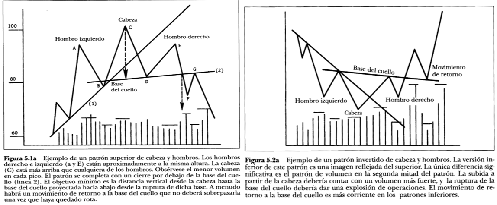

Importancia del volumen

* Encontrar un objetivo de precios \(ver flechas verticales\)
* Ajustar el objetivo de precio a otras lineas mas importantes \(soportes, retrocesos\) mas cercanos.
* Inclinación de la base del cuello: Puede ser horizontal
* Cabeza y hombre complejos: doble cabeza, o doble hombro. Suelen ser simétricos.
* Fallido si cruza de nuevo la base del cuello \(linea 2\).
* En ocasiones puede llegar a ser un patrón de continuidad

### Patrones superiores e inferiores triples

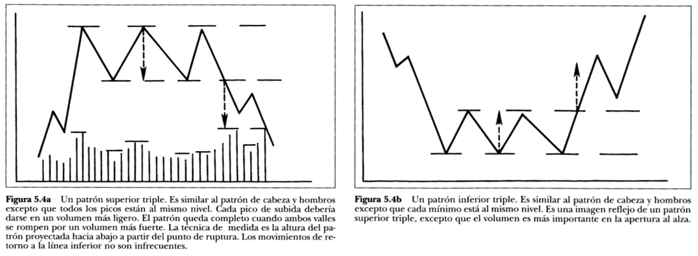

### Patrones superiores e inferiores doble

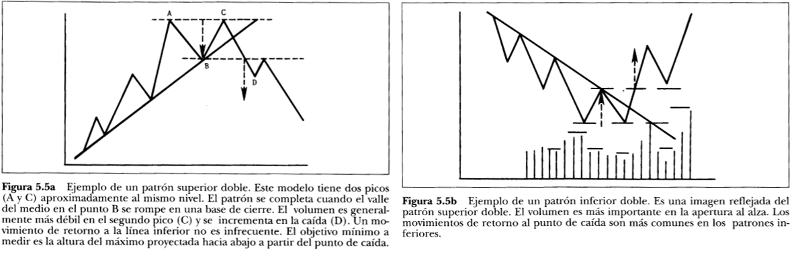

* variaciones: los 2 picos no siempre están alineados.
* Filtros: la mayoría usa filtros para validar el patrón
* El tiempo entre picos y valles es importantes. Cuando mas grande, mayor sera el cambio.

### Patrón de Platillo

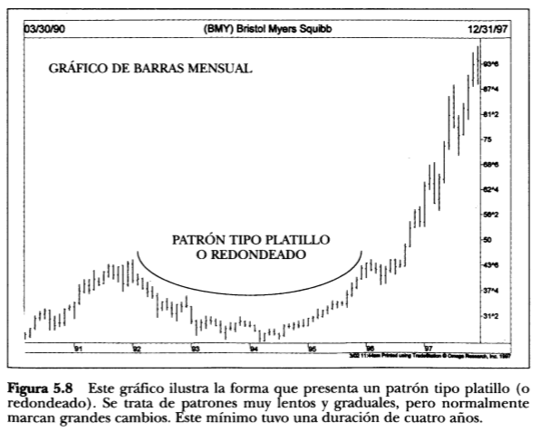

### Patrón Púas

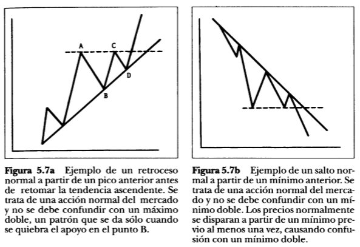

## Capitulo 6 - Modelos de continuidad

### Triángulos

 

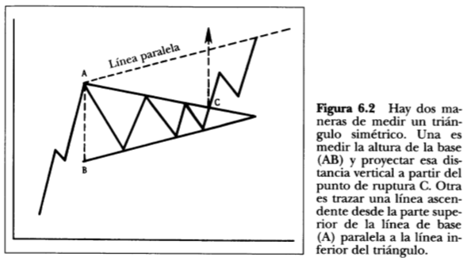

ver proyección Importancia del volumen. Contracción del volumen Triangulo ascendente. La linea de AC es horizontal \(el caso de mercado alcista\). El factor temporal. mas de mes y menos de 3 \(a la diferencia del banderín\)

### Formación Expansiva

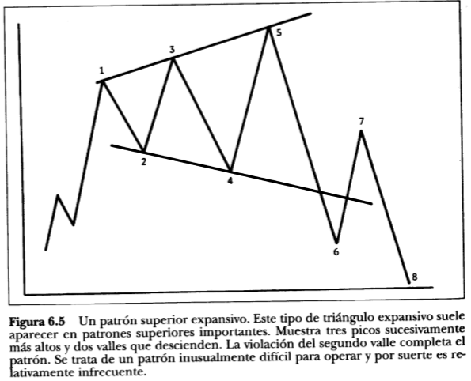

### Bandera

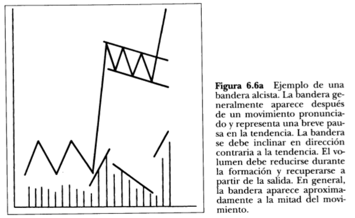

### Banderín

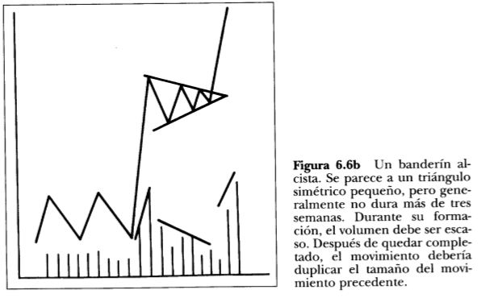

### Cuñas

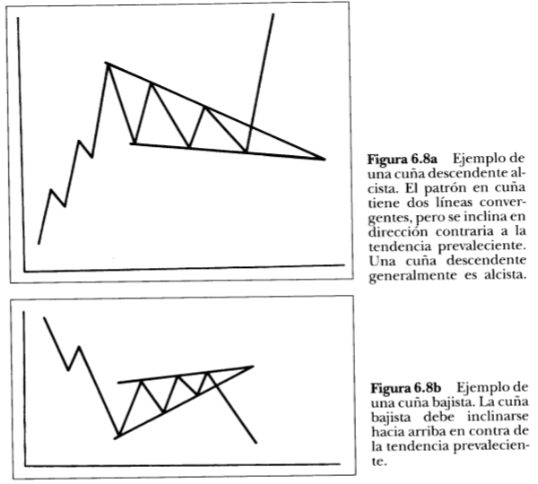

### Formación Rectangular

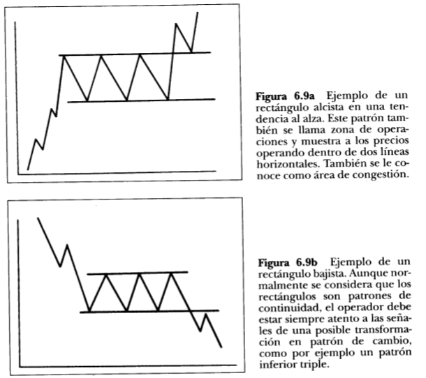

### El modelo de continuidad Cabeza y Hombro

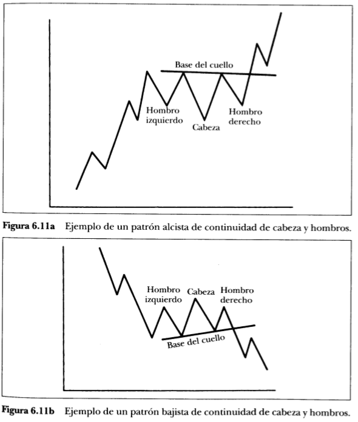

## Capitulo 7 - Volumen e interès compuesto

* se usa de apoyo y confirmación para los patrones.
* El resto no esta resumido por falta de entendimiento de los futuros.

## Capitulo 8 - Graficos a largo plazo

* Importancia de partir de una visión temporal global hasta al día, hora, minutos en función de las necesidades. 
* Perspectiva de los movimientos dentro de movimiento mas grandes.

## Capitulo 12 - Velas japonesas

* No usamos patrones de velas ... si es el caso retomar el resumen. 

