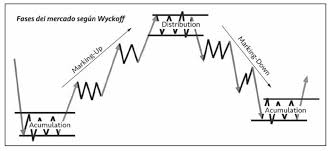
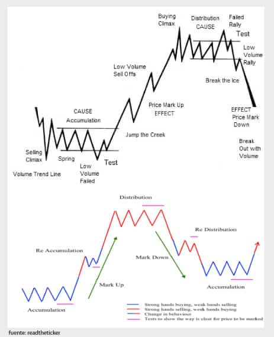

# El método Wyckoff

[amazon](https://www.amazon.es/m%C3%A9todo-Wyckoff-Enrique-Diaz-Valdecantos/dp/8416583137)

autor: profesor en [https://precioyvolumen.com/](https://precioyvolumen.com/) y traductor de Master the markets. Como Wyckoff dijo: _"El mercado financiero es el mayor juego que existe, en el intervienen las personas más ricas, expertas y poderosas del mundo y como ellos, usted tendrá que ser igual de inteligente, astuto y perspicaz"_

## Principios fundamentales

### las 3 leyes fundamentales

1. **La Ley de la Oferta y la Demanda**. Cuando la demanda es mayor que la oferta, los precios suben; y cuando la oferta es mayor que la demanda, los precios bajan. Wyckoff realiza un estudio detallado revisando la variación del precio y el volumen en el tiempo, y sus procesos de consolidación como catalizadores de las grandes oportunidades.
2. **La Ley de la Causa y el Efecto** – Al efecto siempre le antecede una causa, siendo proporcionales. Así, observa que tras la acumulación o distribución en un rango lateral se producen determinados movimientos.
3. **La Ley del Esfuerzo versus el Resultado**. Cuando volumen y precio divergen, frecuentemente hay un cambio de tendencia.

### Fases del mercado

## El arte de leer el gráfico

### las mejores zonas operativas

| ALCISTA | BAJISTA |
| :--- | :--- |
| Spring | Upthrust |
| Test del Spring | Test dek Upthrust |
| Salto de arroyo | Deslizamiento del hielo |
| Back a la zona de arroyo | Back a la zona de hielo |
| Corrección normal en tendencia alcista | Corrección normal en tendencia bajista |

.. viene el detalle de cada fase \(esperando el curso de ECP\)

## Otras fuentes sobre Wyckoff

[https://www.investrading.com/rincon-del-lector/studies-in-tape-reading/](https://www.investrading.com/rincon-del-lector/studies-in-tape-reading/)

Las fases por las que avanzan los mercados, según Wyckoff, aportan información muy valiosa para determinar si debemos estar dentro o fuera.

 

Wyckoff proponía invertir solo en los periodos de “price mark up” y “price mark down”, evitando los momentos de mayor acumulación y distribución, afirmando que no era necesario estar todo el tiempo dentro.

### Las 9 Reglas \(después de una fase de acumulación\) para ponernos largos, según Wyckoff son:

1. Objetivo del precio a la baja cumplido
2. Soporte preliminar, Capitulación \(clímax de venta\), Retest secundario.
3. Actividad alcista \(aumento de volumen en rallies y disminución en los retrocesos\)
4. Avance de la tendencia bajista quebrada
5. Soportes crecientes
6. Máximos crecientes
7. Acción más fuerte que el mercado \(es decir, la acción muestra fortaleza en rallies y debilidad a las reacciones, respecto al índice de referencia\)
8. Formación de base \(desarrollo horizontal del precio\)
9. Relación Beneficio / Riesgo 3 a 1.

### Y las 9 Reglas \(después de una fase de distribución\) para ponernos cortos:

1. Objetivo del precio al alza cumplido
2. Resistencia preliminar, Euforia \(clímax de compra\), Retest secundario
3. Actividad bajista \(aumento de volumen en caídas y disminución en los retrocesos\)
4. Avance de la tendencia alcista quebrada
5. Máximos decrecientes
6. Soportes decrecientes
7. Acción más débil que el mercado \(es decir, la acción no avanza si lo hace el índice de referencia, y cuando el índice baja, en ese momento la acción es más débil aún\).
8. Formación de Cima \(movimiento lateral\)
9. Relación Beneficio / Riesgo 3 a 1.

